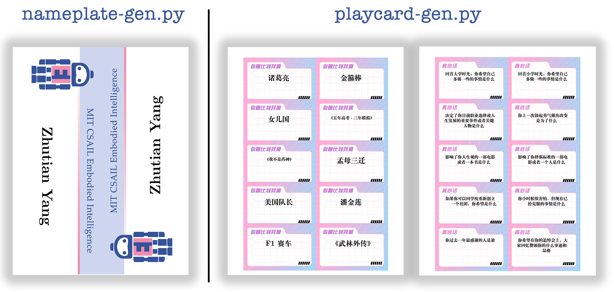

# Printable Name Plate & Play Card PDF Generator



## Usage 

```
python playcard-gen.py -i {input_file} [-b {background_file}]
```

* `-i | --input` can be `.csv` or `.txt`
* `-b | --background`, optional, can be `.png`, `.jpg` or `.pdf`.
* `'-o', '--output'`, output PDF file, default is `'output.pdf'`
* `'-c', '--num_cols'`, default is `2`
* `'-r', '--num_rows'`, default is `5`
* `'-l', '--language'`, wither `'ch'` or `'en'`


## Examples 
```
python playcard-gen.py -i 2020.csv -b 2020.pdf
python playcard-gen.py -i data/240921-HMDance/input.txt -b data/240921-HMDance/background.png -o data/240921-HMDance/output.pdf -r 6
python nameplate-gen.py -i data/240113-EI/input.csv -b data/240113-EI/EI-background.png
```

## Set up

Should be able to run without virtual env. Install `texlive` on MacOS by following [instructions](https://www.tug.org/texlive/) and on `Ubuntu` by running:

```
apt-get install texlive-xetex texlive-latex-recommended texlive-latex-extra
```